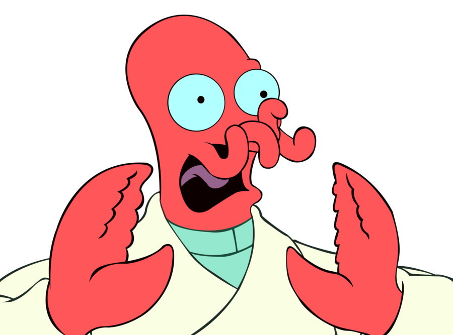

 

  

<h3 align="center">WHOOP WHOOP WHOOP</h3>

  

    WHOOP WHOOP WHOOP
     
     
    <a href="https://www.whoop.me">View Site</a>
    ·
    <a href="https://github.com/ruudvh/whoop.me/issues">Report Bug</a>
  

## About The Project
WHOOP WHOOP WHOOP

## Built With
* Plain HTML / CSS / JS
* Gifs randomly provided by: [Giphy](www.giphy.com) API

## License
Distributed under the MIT License. See `LICENSE.txt` for more information.

(<a href="#top">back to top</a>)

